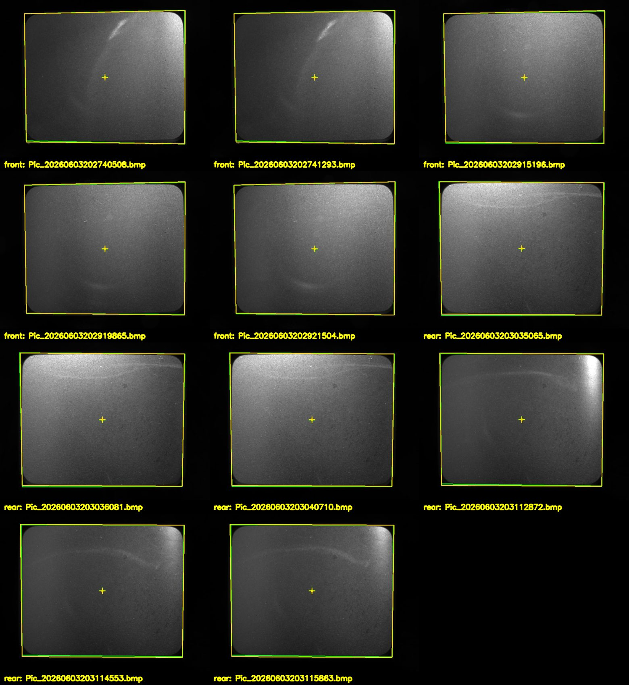

# 取景框中心定位方法-框形约束定位法

本文整理从取景框图片中求解框体中心点的过程。这个中心点不是最终测距结果，
而是连接设备几何尺寸与相机坐标系的转接点：我们既知道它在设备结构中的
相对位置，也可以从相机图片中恢复它在相机坐标系下的位置。


## 1. 方法命名

这里把当前路线称为 **框形约束定位法**。

它的核心思想是：不只依赖单个像素点，而是利用设备上已知形状的取景框，
从图像中拟合出框体边缘、角点和中心。随后可以把这个中心像素点通过相机
内参和成像面平面反投影到相机坐标系，也可以把拟合出的图像形状与设备
实际形状做几何比对，从而求解取景框中心在相机坐标系中的位置。


## 2. 背景与目的

DCPAM 当前主线已经可以从前、后相机图片中提取激光光斑圆心，并把两个光斑点
统一到前相机坐标系中。后续还需要知道设备上的靶点在相机坐标系中的位置，
否则无法计算靶点到激光线的距离。

取景框中心点可以作为这个求解过程的锚点。原因是：

- 图像中可以观测到取景框；
- 设备结构中可以定义取景框中心和靶点之间的几何关系；
- 取景框中心可以通过图像和标定数据转换到相机坐标系；
- 得到该中心点后，可继续用设备几何尺寸推导靶点位置。


## 3. 输入数据

当前用于验证的图片位于：

```text
dataset/frame/front
dataset/frame/rear
```

前相机目录下有 6 张取景框图片，后相机目录下有 7 张取景框图片。
处理结果输出到各自目录下的 `rectangle_detection` 文件夹。


## 4. 图像处理流程

第一步是预处理。原始图片分辨率为 `2592 x 1944`，为了提高处理速度，
脚本先按比例降采样，再进行灰度高斯模糊。取景框内层边缘的灰度层级
主要位于黑色背景和灰色成像面之间，因此当前用固定阈值提取内层区域。

第二步是轮廓提取。二值化后对区域做闭运算和开运算，减少局部噪声，
再提取最大外轮廓作为内层取景框轮廓。

第三步是四边形拟合。由于相机畸变、透视关系和安装角度的影响，
取景框在图片中不一定是水平竖直的轴对齐矩形，也可能表现为轻微梯形。
因此当前不再使用 `boundingRect` 这类轴对齐外接框，而是先把轮廓点
按局部方向分为上、下、左、右四组，再分别拟合四条直线。四条直线两两
相交后得到四个角点：

```text
top_left, top_right, bottom_right, bottom_left
```

第四步是中心点计算。单张图片的中心点由四个角点的均值得到：

```text
center = mean(top_left, top_right, bottom_right, bottom_left)
```

第五步是多图平均。对同一相机目录下的多张图片，先计算每张图片的内层
四边形，再求粗平均四边形。随后计算每张图片四个角点相对粗平均四边形
的 RMS 偏差，明显偏大的图片不参与最终平均。最终得到一个稳定的平均
四边形和平均中心点。


## 5. 离群过滤

当前使用的偏差指标是四个角点的均方根距离：

```text
corner_rms = sqrt(mean(||corner_i - mean_corner_i||^2))
```

默认规则为：

```text
corner_rms > mean(corner_rms) + 1 * std(corner_rms)
```

满足该条件的图片视为离群，不参与最终平均，但仍保留标注图，方便人工检查。

本次数据中自动排除了两张明显偏差较大的图片：

```text
dataset/frame/front/Pic_20260603202843113.bmp
dataset/frame/rear/Pic_20260603203105739.bmp
```


## 6. 当前输出

脚本为每张原图生成一张标注图：

```text
dataset/frame/front/rectangle_detection/*_inner.jpg
dataset/frame/rear/rectangle_detection/*_inner.jpg
```

图中绿色表示单张图片拟合出的内层四边形和中心点，黄色表示同一相机目录下
最终平均得到的内层四边形和平均中心点。

脚本同时保存两个 CSV：

```text
inner_quadrilaterals.csv
average_inner_quadrilateral.csv
inner_quadrilateral_deviations.csv
```

其中 `inner_quadrilaterals.csv` 记录每张图的四个角点和中心点，
`average_inner_quadrilateral.csv` 记录最终平均四边形和平均中心点，
`inner_quadrilateral_deviations.csv` 记录每张图片的 RMS 偏差以及是否参与平均。


## 7. 标注结果总览

下图汇总了参与最终平均的取景框标注结果，已去掉 RMS 偏差较大的两张离群图片。
绿色表示单张图片拟合出的内层四边形和中心点，黄色表示最终平均四边形和平均中心点。




## 8. 当前结果

前相机平均内层中心像素为：

```text
u = 1298.0391269024954
v = 954.6081558526163
```

后相机平均内层中心像素为：

```text
u = 1264.2041115445224
v = 949.8409549127194
```

这些像素中心点后续可以进入相机几何流程：先结合对应相机内参得到相机射线，
再与取景框所在的成像面或拟合平面求交，得到相机坐标系下的三维中心点。


## 9. 后续用法

取景框中心点有两种使用方式。

第一种是 **反投影定位**。把中心像素点通过内参转换为相机射线，
再与已知成像面或由取景框拟合出的平面求交，得到中心点在相机坐标系下的
三维坐标。

第二种是 **框形约束定位**。利用取景框的真实尺寸、四个角点的图像位置
以及相机内参，通过几何约束反求取景框所在平面和中心点位置。这种方式
不仅使用中心像素，还使用整个框形，因此在标定面不确定时有机会提供
额外约束。

当前阶段建议先把平均中心像素和平均四边形作为图像侧稳定观测量。
等框体真实尺寸、中心到靶点的设备几何关系明确后，再把该中心点转换到
相机坐标系，并进一步推导靶点在相机坐标系下的位置。
