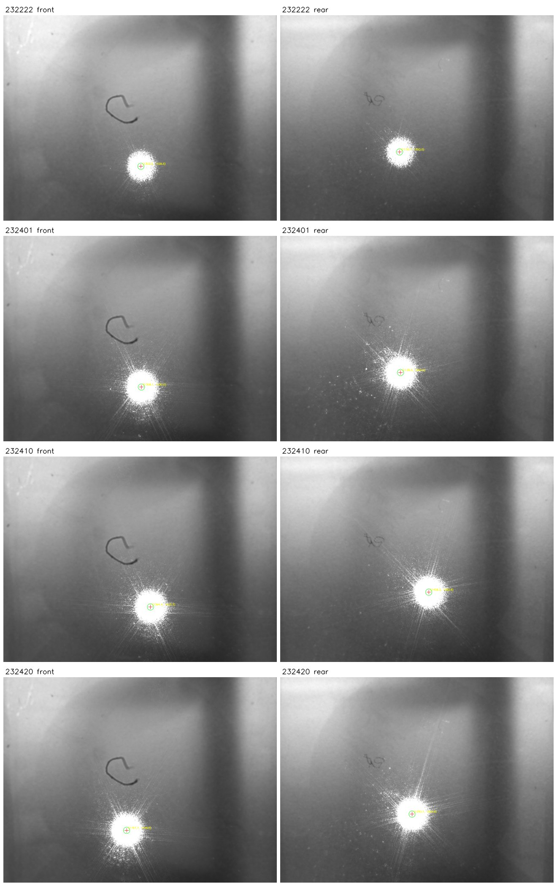

# 光斑提取算法测试报告

> 测试日期：2026-05-08
> 测试图像：4 组双相机拍摄（共 8 张），来自 `~/.dcpam/captures/`

## 算法概述

当前采用 **阈值加权重心法 + 连通域筛选** 提取光斑中心：

1. 高斯模糊（kernel=9, sigma=2.0）抑制噪声
2. 按图像最大亮度的固定比例（threshold_ratio=0.95）二值化
3. 连通域分析，选取面积最大且 ≥ 500 px 的连通域
4. 在该连通域内以亮度为权重计算加权重心 (u, v)

该方法是确定性算法，同一张图像每次运行结果完全一致。

## 测试数据

| 编号 | 采集时间 | 说明 |
|------|----------|------|
| C_20260507_232222 | 23:22:22 | 存在较强环境反射 |
| C_20260507_232401 | 23:24:01 | 正常 |
| C_20260507_232410 | 23:24:10 | 正常 |
| C_20260507_232420 | 23:24:20 | 正常 |

## 1. 提取结果（threshold=0.95）

| 采集编号 | 相机 | u (px) | v (px) | 光斑面积 (px) | 连通域数 |
|----------|------|-------:|-------:|--------------:|---------:|
| 232222 | front | 1302.54 | 1428.53 | 44,163 | 126 |
| 232222 | rear  | 1130.71 | 1292.96 | 40,462 | 46 |
| 232401 | front | 1308.06 | 1430.01 | 65,756 | 44 |
| 232401 | rear  | 1139.53 | 1293.21 | 63,740 | 85 |
| 232410 | front | 1394.41 | 1423.25 | 66,671 | 41 |
| 232410 | rear  | 1408.22 | 1282.58 | 64,805 | 59 |
| 232420 | front | 1167.71 | 1448.53 | 68,415 | 33 |
| 232420 | rear  | 1250.09 | 1294.88 | 69,105 | 73 |

232222 光斑面积明显小于其余三组（~42k vs ~66k），
是因为该帧存在较强的环境光反射，高阈值将更多像素排除。

### 提取结果可视化

## 2. 重复性测试

对每张图像重复提取 20 次：

| 指标 | 结果 |
|------|------|
| u 标准差 | 0.000000 px |
| v 标准差 | 0.000000 px |

算法为确定性计算（无随机采样），重复性为零偏差。
同一图像无论执行多少次，结果完全一致。

## 3. 阈值敏感度分析

在 0.90 ~ 0.99 范围内测试阈值对提取坐标的影响：

### 正常帧（232401, 232410, 232420）

| 采集编号 | 相机 | u@0.90 | u@0.95 | u@0.99 | v@0.90 | v@0.95 | v@0.99 |
|----------|------|-------:|-------:|-------:|-------:|-------:|-------:|
| 232401 | front | 1309.73 | 1308.06 | 1307.17 | 1430.56 | 1430.01 | 1429.00 |
| 232401 | rear  | 1140.32 | 1139.53 | 1138.22 | 1292.51 | 1293.21 | 1292.90 |
| 232410 | front | 1395.22 | 1394.41 | 1392.08 | 1423.54 | 1423.25 | 1421.95 |
| 232410 | rear  | 1409.68 | 1408.22 | 1406.02 | 1282.15 | 1282.58 | 1281.96 |
| 232420 | front | 1167.86 | 1167.71 | 1165.58 | 1448.48 | 1448.53 | 1448.39 |
| 232420 | rear  | 1251.29 | 1250.09 | 1247.80 | 1293.96 | 1294.88 | 1296.37 |

阈值从 0.95 变到 0.99，中心坐标偏移统计：

| 指标 | 值 |
|------|------|
| 平均偏移 | 2.09 px |
| 最大偏移 | 2.73 px |
| 最小偏移 | 1.35 px |

阈值在 0.90 ~ 0.99 范围内，正常帧的提取结果波动 < 3 px，
说明算法对阈值参数不敏感，鲁棒性良好。

### 反射干扰帧（232222）

| 相机 | u@0.90 | u@0.95 | u@0.99 |
|------|-------:|-------:|-------:|
| front | 331.06 | 1302.54 | 1299.57 |
| rear  | 317.56 | 1130.71 | 1129.48 |

232222 在阈值 ≤ 0.92 时提取失败：

- front@0.90 提取到 (331, 161)，偏离真实光斑近 1600 px
- rear@0.90 提取到 (318, 71)，同样完全错误

原因是低阈值下图像左上角的环境反射区域面积超过了真实光斑，
被连通域面积筛选选中。阈值提高到 0.95 后反射区域被排除，提取正常。

这说明 **阈值 0.95 是当前算法的安全下限**。

## 4. 结论

**优势：**

- 确定性算法，重复性为零偏差
- 正常环境下阈值 0.90~0.99 内波动 < 3 px
- 计算速度快（~80ms / 张）

**已知局限：**

- 对强环境反射敏感，低阈值下会误选反射区域
- 依赖「光斑是最大连通域」的假设，当反射面积超过光斑时失效
- 232222 在阈值 < 0.95 时提取失败

**建议：**

- 当前阈值固定为 0.95，能覆盖所有测试帧
- 后续如果环境光干扰加剧，可考虑引入形状约束（圆度）或空间先验（ROI 限制）
